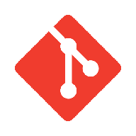
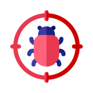

# Agent Skills [![GitHub Actions][gh-actions-image]][gh-actions-url]

This repository stores custom AI-agent skills made for
[Denys Dovhan](https://github.com/denysdovhan). They capture repeatable
workflows, project preferences, and domain-specific guidance that Denys wants
available across local agent sessions.

## Installation

```bash
npx skills add denysdovhan/agents
```

After running this command, select the required skill in the CLI prompt.

## Included Skills

| Skill | Description |
|---|---|
|  [`commit`](skills/commit/SKILL.md) | Prepare focused git commits with scoped staging and clear commit messages. |
|  [`design-log`](skills/design-log/SKILL.md) | Maintain a design log of product and engineering decisions in `.agents/log`. |
|  [`home-assistant-card`](skills/home-assistant-card/SKILL.md) | Create, review, debug, and maintain Home Assistant custom Lovelace cards and card editors. |
|  [`home-assistant-integration`](skills/home-assistant-integration/SKILL.md) | Create, scaffold, review, and maintain Python Home Assistant custom integrations using current developer docs and quality rules. |
|  [`interactive-debugging`](skills/interactive-debugging/SKILL.md) | Debug runtime behavior with temporary local HTTP probes and runtime logs. |

## Local Validation

Run the repository validation script:

```bash
./scripts/validate-skills.sh
```

The script bootstraps `skills-ref` automatically into `.skill-ref/skills-ref` with a shallow clone if it is missing.

Validate a single skill directly:

```bash
.skill-ref/skills-ref/.venv/bin/skills-ref validate skills/commit
```

## License

[MIT](LICENSE) © [Denys Dovhan](https://github.com/denysdovhan)

<!-- Badges -->

[gh-actions-image]: https://img.shields.io/github/actions/workflow/status/denysdovhan/agents/validate-skills.yml?branch=main&style=flat-square
[gh-actions-url]: https://github.com/denysdovhan/agents/actions/workflows/validate-skills.yml
